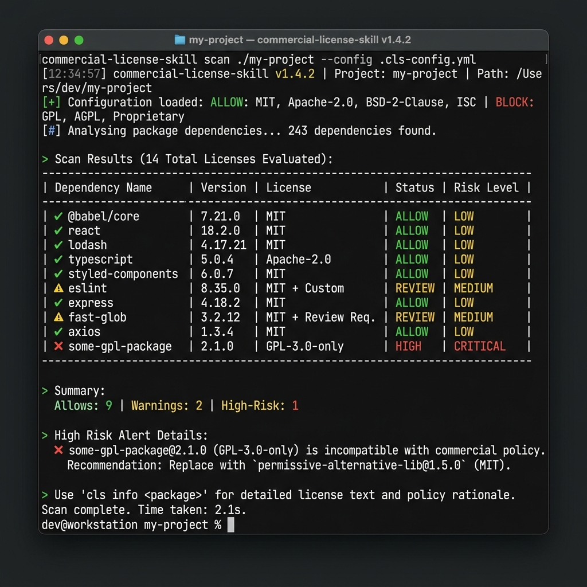

# 🧼 commercial-license-skill

> Commercial-safe dependency triage & permissive recommendations as a portable Agent Skill and CLI.

[](https://www.npmjs.com/package/commercial-license-skill)
[](LICENSE)
[](https://nodejs.org)

---

## 📦 Installation

To install the CLI globally:

```bash
npm install -g commercial-license-skill
```

To register as a portable Agent Skill interactively (Claude Code, OpenAI Codex, Gemini CLI, etc.):

```bash
npx commercial-license-skill install
```

---

## 🔍 Usage

To scan your project for copyleft license risks and discover permissive alternatives:

```bash
npx commercial-license-skill scan
```



---

## 📂 Documentation

*   For MCP Server setup, see [docs/MCP_SETUP.ko.md](docs/MCP_SETUP.ko.md).
*   For development and publishing, see [docs/PUBLISHING.ko.md](docs/PUBLISHING.ko.md).
*   For roadmap and static analysis internals, see [docs/ARCHITECTURE.md](docs/ARCHITECTURE.md).
