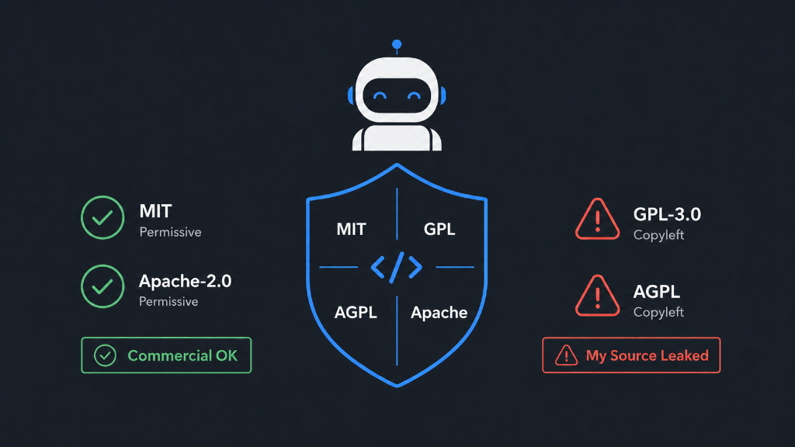

# 🧼 commercial-license-skill

> Commercial-safe dependency triage & permissive recommendations as a portable Agent Skill and CLI.

[English](#-english) | [한국어](#-한국어)

---

## 🇺🇸 English

[](https://www.npmjs.com/package/commercial-license-skill)
[](LICENSE)
[](https://nodejs.org)

`commercial-license-skill` scans your project dependencies for copyleft or restrictive licenses (like GPL, AGPL, SSPL, etc.) and suggests commercial-safe permissive alternatives (such as MIT, Apache-2.0, or BSD). It is designed to run both as a standard **npm CLI tool**, a **Model Context Protocol (MCP) server**, and a **portable Agent Skill** for AI coding assistants.

> [!WARNING]
> **DISCLAIMER: NOT LEGAL ADVICE**
> The evaluations, reports, and recommendations generated by this tool are engineering triage aids designed for informational purposes. They do not constitute formal legal advice. Software licenses and compliance obligations depend heavily on your distribution model, linking mechanism, and specific modifications. You should consult a qualified legal professional or licensing counsel before making final release decisions.

> [!NOTE]
> This project is designed as a **zero-dependency** library. It uses only Node.js native APIs for speed, security, and lightweight installation footprints.

### 🛡️ Why Verify Commercial Licenses?



In commercial software development, dependency license compliance is not optional—it is critical. Introducing strong copyleft licenses (like GPL or AGPL) into a proprietary codebase can trigger viral disclosure obligations, forcing you to release your proprietary source code to the public. 

To prevent these business-critical legal risks, it is vital to detect copyleft licenses early and actively substitute them with commercial-safe, permissive alternatives (such as MIT, Apache-2.0, or BSD). `commercial-license-skill` shields your software supply chain by automating this triage, giving developers the visibility they need to keep codebases legally secure.

---

## 📦 Installation

To install the CLI globally:

```bash
npm install -g commercial-license-skill
```

To register as a portable Agent Skill interactively (Claude Code, OpenAI Codex, Gemini CLI, etc.):

```bash
npx commercial-license-skill install
```

---

## 🔍 Usage

To scan your project for copyleft license risks and discover permissive alternatives:

```bash
npx commercial-license-skill scan
```


### Alias: `leechshield`

`leechshield` is a shorter command alias for `commercial-license-skill`. Named after its ability to shield your codebase from viral copyleft licenses (like GPL/AGPL "tivoization" or source disclosure obligations).

```bash
leechshield scan .
# Equivalent to: commercial-license-skill scan .
```

---

## ⚙️ CLI Reference

### `scan [path]`
Scans the dependencies under the target path.

| Flag | Default | Description |
| :--- | :--- | :--- |
| `--format` | `human` | Output format: `human` \| `json` \| `sarif` |
| `--output` | stdout | Writes the report directly to a file |
| `--include-dev` | `false` | Include development dependencies in the scan |
| `--fail-on` | `null` | Exit with code 2 if any risk meets/exceeds: `review` \| `high` \| `critical` |
| `--ignore` | `null` | Comma-separated list of package names to ignore |
| `--no-snippets` | `false` | Exclude code snippet lines from the output for privacy/security |
| `--max-snippet-length` | `240` | Maximum character length of a code snippet |

### `recommend <package>`
Recommends permissive alternatives for a specific package.

| Flag | Default | Description |
| :--- | :--- | :--- |
| `--online` | `false` | Dynamically queries the npm registry to find alternatives |
| `--json` | `false` | Outputs the recommendations in JSON format |

### `mcp`
Starts a stdio-based MCP server for Claude Desktop or Claude Code integration. Exposes a path allowlist that defaults to the current working directory, expandable with `--allow-root <path>`.

### `install`
Launches the interactive installer to register the skill. Supports timestamped `.bak` backups when overwriting target skills to preserve user edits.

---

## 📊 Supported Ecosystems & Status

| Ecosystem | Manifest File(s) | Status |
| :--- | :--- | :--- |
| **Node.js (npm)** | `package.json` / `package-lock.json` | ✅ Supported |
| **Python** | `requirements.txt` / `requirements-dev.txt` | ✅ Supported |
| **Rust (Cargo)** | `Cargo.lock` | ✅ Supported |
| **Go** | `go.mod` | ✅ Supported |
| **Node.js (pnpm)** | `pnpm-lock.yaml` | 🚧 Planned |
| **Node.js (yarn)** | `yarn.lock` | 🚧 Planned |
| **Python (uv)** | `uv.lock` | 🚧 Planned |

---

## 📄 Output Examples

### `human` (default)
```text
CommercialLicenseSkill — commercial-safe dependency triage
Root: /path/to/project
Summary: 142 dependencies | critical 1 | high 1 | review 0 | allow 140

✗ [CRITICAL] npm:lodash-gpl@4.17.21 — GPL-3.0
  scope: runtime; source: package.json
  Strong copyleft license. Requires source-disclosure of combined works.
  usage: 2 source reference(s) found
    - src/index.js:5 [import] import _ from 'lodash-gpl';
  alternatives:
    - lodash (MIT) — Drop-in replacement with permissive terms.
```

### `json`
```json
{
  "schemaVersion": "1.0",
  "tool": "commercial-license-skill",
  "generatedAt": "2026-06-04T12:00:00.000Z",
  "summary": {
    "total": 1,
    "allow": 0,
    "review": 0,
    "high": 0,
    "critical": 1
  },
  "dependencies": [
    {
      "ecosystem": "npm",
      "name": "lodash-gpl",
      "version": "4.17.21",
      "license": "GPL-3.0",
      "assessment": {
        "level": "critical",
        "reason": "Strong copyleft license. Requires source-disclosure of combined works."
      },
      "recommendations": [
        {
          "name": "lodash",
          "license": "MIT",
          "note": "Drop-in replacement with permissive terms."
        }
      ]
    }
  ]
}
```

### `sarif` (CI/CD integration)
```json
{
  "version": "2.1.0",
  "$schema": "https://json.schemastore.org/sarif-2.1.0.json",
  "runs": [
    {
      "tool": {
        "driver": {
          "name": "commercial-license-skill",
          "version": "0.3.2",
          "informationUri": "https://github.com/Aminoragit/commercial-license-skill"
        }
      },
      "results": [
        {
          "ruleId": "license-critical",
          "level": "error",
          "message": {
            "text": "lodash-gpl@4.17.21: GPL-3.0. Strong copyleft license. Requires source-disclosure of combined works."
          }
        }
      ]
    }
  ]
}
```

---

## 🚀 CI/CD Integration

You can easily integrate `commercial-license-skill` into your GitHub Actions pipeline to block pull requests introducing copyleft licenses.

```yaml
# .github/workflows/license-check.yml
name: License Compliance Check

on: [push, pull_request]

jobs:
  license-scan:
    runs-on: ubuntu-latest
    steps:
      - name: Checkout Code
        uses: actions/checkout@v4

      - name: Setup Node.js
        uses: actions/setup-node@v4
        with:
          node-version: 20

      - name: Scan Dependencies
        run: npx commercial-license-skill scan . --format sarif --output results.sarif --fail-on high

      - name: Upload SARIF report
        if: always()
        uses: github/codeql-action/upload-sarif@v3
        with:
          sarif_file: results.sarif
```

---

## 🛠️ MCP Server Integration

To register `commercial-license-skill` as an MCP server in your `claude_desktop_config.json`:

```json
{
  "mcpServers": {
    "commercial-license-skill": {
      "command": "npx",
      "args": ["-y", "commercial-license-skill", "mcp"]
    }
  }
}
```

For more details, see [docs/MCP_SETUP.ko.md](docs/MCP_SETUP.ko.md).

---

## 🤝 Contributing

We welcome contributions! Please make sure to:
- Follow the **Clean-room replacement rule** (do not copy copyleft implementation code).
- Write automated tests for new resolvers.
- Keep implementation zero-dependency.

---

## 📄 License

This project is licensed under the Apache License 2.0 - see the [LICENSE](LICENSE) file for details.

---


## 📄 라이선스 (License)

이 프로젝트는 Apache License 2.0 하에 배포됩니다. 자세한 내용은 [LICENSE](LICENSE) 파일을 확인하십시오.
